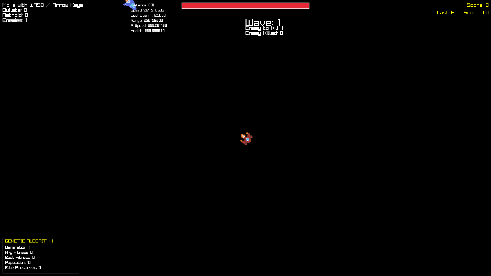

# SpaecAutonomous

[](assets/demo_video.mp4)
A space shooter game built with C++17 and [raylib](https://www.raylib.com/). Features a player-controlled rocket, AI-driven enemy ships, bullet combat, and a wave-based spawning system.


---

## Features

- Smooth WASD/Arrow key movement with mouse-based rotation
- Auto-fire bullets toward mouse cursor
- AI enemies with steering behavior and wobble effects
- Wave-based enemy spawning system
- Persistent high score storage
- Cross-platform: Linux desktop and Web (Emscripten)

---

## Getting Started

### Clone the Repository

This project uses **raylib as a submodule**. Use `--recursive` when cloning:

**HTTPS:**
```bash
git clone --recursive https://github.com/Avel-Dev/AI_GAME.git
cd AI_GAME
```

**SSH:**
```bash
git clone --recursive git@github.com:Avel-Dev/AI_GAME.git
cd AI_GAME
```

If you already cloned without `--recursive`, initialize submodules manually:
```bash
git submodule update --init --recursive
```

---

## Linux Build

### Prerequisites

Install raylib dependencies:

```bash
sudo apt-get update
sudo apt-get install -y libgl1-mesa-dev libxi-dev libxcursor-dev libxrandr-dev libxinerama-dev libwayland-dev wayland-protocols
```

### Build

```bash
# Configure
cmake -B build

# Compile
cmake --build build
```

### Run

```bash
cd build && ./SpaecAutonomous
```

> **Note:** The executable must be run from the build directory (or any directory containing the `assets/` folder) to load textures and sounds correctly.

---

## Web Build (Emscripten)

### Prerequisites

Install and activate [Emscripten](https://emscripten.org/docs/getting_started/downloads.html).

### Build

```bash
# Configure with Emscripten toolchain
emcmake cmake -B build_web

# Compile
cmake --build build_web
```

The build produces:
- `SpaecAutonomous.html`
- `SpaecAutonomous.js`
- `SpaecAutonomous.wasm`
- `SpaecAutonomous.data` (preloaded assets)

### Serve and Test

```bash
cd build_web && python3 -m http.server 8000
```

Open `http://localhost:8000/SpaecAutonomous.html` in your browser.

---

## Project Structure

```
AI_GAME/
├── assets/                 # Game assets (textures, sounds)
│   ├── Roket_anim.png
│   └── ...
├── raylib/                 # raylib submodule (git submodule)
├── CMakeLists.txt          # Main CMake configuration
├── CLAUDE.md               # Project documentation for developers
├── main.cpp                # Entry point
├── Game.hpp/cpp            # Game state manager and main loop
├── Player.hpp/cpp          # Player rocket logic
├── Enemy.hpp/cpp           # Enemy AI and behavior
├── GameObjects.hpp/cpp     # Bullets, asteroids, and other entities
└── build/                  # Build output (generated)
    └── SpaecAutonomous     # Linux executable
```

---

## Submodule Notes

- **raylib** is included as a Git submodule pointing to the official repository
- The project uses `add_subdirectory(raylib)` in CMakeLists.txt to build raylib automatically
- To update the submodule to the latest version:
  ```bash
  cd raylib
  git pull origin master
  cd ..
  git add raylib
  git commit -m "Update raylib submodule"
  ```

---

## Controls

| Key | Action |
|-----|--------|
| `W` / `↑` | Move forward |
| `S` / `↓` | Move backward |
| `A` / `←` | Rotate left |
| `D` / `→` | Rotate right |
| `Mouse` | Aim direction |
| `R` | Restart (on game over) |

---

## License

This project is open source. See repository for license details.
